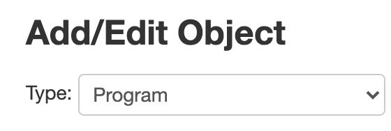
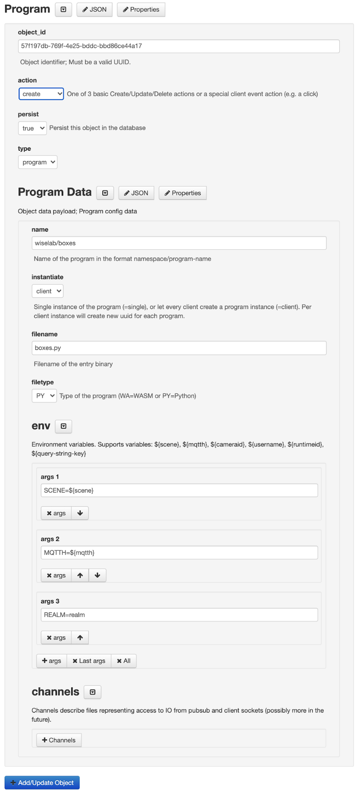

Scene Edit/Program Launch Example
=================================



Quick Reference
---------------

* Scene [pytest](https://arena.andrew.cmu.edu/?scene=pytest) loads a python program stored at the [file store](https://arena.andrew.cmu.edu/storemng), under folder boxes for user **wiselab**.
* Go to the [file store](https://arena.andrew.cmu.edu/storemng) and edit **boxes/boxes.py** to see the program code.
* Edit this scene in the [builder](https://arena.andrew.cmu.edu/build/), to see the program object stored. 
* See the [ARTS gui](https://arena.andrew.cmu.edu/arts/) to see the runtimes and modules running.

Step by Step Example
--------------------

How to launch a program (e.g. **boxes/boxes.py**) in a [file store](https://arena.andrew.cmu.edu/storemng).

1\. Edit Scene: [https://arena.andrew.cmu.edu/build/](https://arena.andrew.cmu.edu/build/)

2\. Make sure the arena and mqtt host are **https://arena.andrew.cmu.edu/** and **arena.andrew.cmu.edu:8083**:

{:width="300px"}

(the {:width="300px"} message indicates it successfully queried the persist db)

3\. Enter a name for your new scene (e.g. **pytest**)

{:width="400px"}

4\. Add a program. By selecting type “program” in the Add/Edit Object select: 
{:width="200px"}

5\. Edit the program attributes. Make sure to assign a unique object id (use {:width="100px"}), and:

- **action** is “create”,
- **type** is “program” and
- **name** is in the form **<username in the arena store>/<folder in the arena store>** (e.g. **wiselab/boxes** for a program under folder **boxes** of the home folder for user **wiselab** in the arena store)
- **instantiate** indicates if a program instance is started for each viewer (browser) or single instance per scene
- **filename** is the program entry file (e.g. boxes.py)
- **filetype** is either python or wasm, depending on your program
- Add environment variables and arguments as needed by the program (for example, the program might read environment variable SCENE to know its scene, then add an environment variable: SCENE=${scene}, where ${scene} will be replaced by the scene name)



{:width="80%"}

6\. **Finalize by pressing the {:width="150px"} button.** You should see the new program object in the scene object list:

{:width="80%"}

7\. Goto to the folder of the program in the [file store](https://arena.andrew.cmu.edu/storemng) and add your files there. These can be wasm programs or python programs that use the **arena.py** library. See an example in **[wiselab/boxes](https://arena.andrew.cmu.edu/storemng/share/1KoiGaWq)**.

8\. Open the Scene using {:width="200px"}at the top of the build page (the link should be something like https://arena.andrew.cmu.edu/?scene=\[scene-name\])

9\. See ARTS GUI: [https://arena.andrew.cmu.edu/arts/](https://arena.andrew.cmu.edu/arts/)