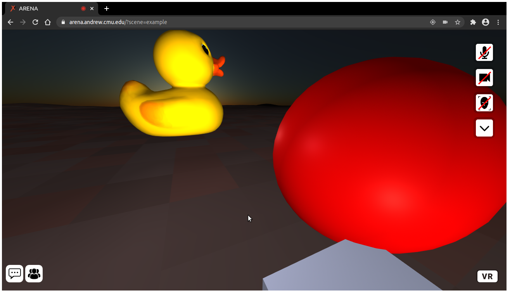

# Quick Start Tutorial

Most of the ARENA utilities and tools mentioned here are also listed on a set of quick links on the left side bar as [Source and Links](source.html).

## View the ARENA

To start, open your browser to the scene we will be using in this tutorial. This link will open in a new tab: [https://arena.andrew.cmu.edu/?scene=example](https://arena.andrew.cmu.edu/?scene=example){:target="\_blank"}. Since ARENA is a collaborative, multi-user environment, you may see other tutorial learners there. Say Hi!




## Move around

When you first enter the ARENA, your perspective position in the scene will be at x, y, z coordinates (0, 1.6, 0) which is at the center of the ground plane at about 1.6 meters in the air. Take some time to familiarize yourself with movement and other controls, some of which are listed below. Most importantly:

- **Rotate**: Left-Right arrow keys, or click and hold to drag the screen.
- **Move**: Forward-Back arrow keys, or W-A-S-D keys.

There are several choices here to hold [video conferences and screensharing](presence) in the ARENA.

| Button                                                                                                                                                                                                           | Action             | Description                                                                                                         |
| ---------------------------------------------------------------------------------------------------------------------------------------------------------------------------------------------------------------- | ------------------ | ------------------------------------------------------------------------------------------------------------------- |
| {:height="32px" width="32px"} {:height="32px" width="32px"}                                                                                    | **Settings**       | Expand/Collapse settings along the right.                                                                           |
| {:height="32px" width="32px"} {:height="32px" width="32px"}                                                                           | **Microphone**     | Speak into the ARENA, or remain silent.                                                                             |
| {:height="32px" width="32px"} {:height="32px" width="32px"}                                                                           | **Camera**         | Let your camera show you as a moving box with your camera image on it.                                              |
| {:height="32px" width="32px"} {:height="32px" width="32px"}                                                                       | **Facial Avatar**  | Let your camera recognize your facial features, and you will appear an animated head matching your facial movement. |
| {:height="32px" width="32px"} {:height="32px" width="32px"}                                                                         | **Flight**         | Movement defaults to walking along the ground, this will enable you to fly up or even down through the ground.      |
| {:height="32px" width="32px"} {:height="32px" width="32px"} {:height="32px" width="32px"} | **Movement Speed** | Slow/Medium/Fast, defaults to Medium.                                                                               |
| {:height="32px" width="32px"}                                                                                                                                              | **Screenshare**    | Share your screen as a large panel in the ARENA.                                                                    |
| {:height="24px" width="24px"}                                                                                                                                                   | **Chat Messages**  | Open chat messaging.                                                                                                |
| {:height="24px" width="24px"}                                                                                                                                              | **User List**      | Open list of present users.                                                                                         |
| {:height="32px" width="32px"}                                                                                                                                                 | **Sign Out**       | Exit the ARENA.                                                                                                     |

## Install the ARENA Python library

The easiest way to begin programming in the ARENA is to install the [Python library](python/) and create your first Python program. ARENA communications are a series of MQTT messages which govern all objects and their properties. This library is a wrapper which will allow you to easily send and receive those messages.

## Create a cube and observe

Now, create the simplest Python program you can below, which will generate a 1-meter cube. By default, objects are generated in white (#FFFFFF), with no rotation, at scene x, y, z position (0, 0, 0), and with no other properties applied. Some of the other properties you can add to objects are detailed in our [Python Examples](python/examples.html). Notice that cube seems stuck in the ground, which is due to the cube's origin at its center positioned at scene coordinates (0, 0, 0). If you enable Flying mode (see above), you can move below the ground plane and view the other half of the cube. Type Ctrl-C to end the program.



```python
import arena
arena.init("arena.andrew.cmu.edu", "realm", "example")
arena.Object(objType=arena.Shape.cube)
arena.handle_events()
```


## Clients and Scene Callbacks

As a web browser user of the ARENA, you are connecting to the ARENA MQTT broker as a one client connection, in which you are publishing your "camera" perspective as you move, and subscribing to changes in other objects and other users' "camera" moves. Everything time you run a Python program you are also connecting to the broker as another client connection, in which the above program published a message creating a cube, and also subscribes you other users "camera" moves, and objects.

Let's try observing some of those other messages but adding the following code to your Python program. Add the `scene_callback` function, and also alter your `arena.init()` call, to accept the new callback and allow you to observe all the messages you have subscribed to in this scene.

```python
def scene_callback(msg):
    print("scene_callback: ", msg)

arena.init("arena.andrew.cmu.edu", "realm", "example", scene_callback)
```

Move yourself around in the browser view and notice all the camera updates and positions and rotation changes as you move. This is way too much information to be human readable! However, you can filter out these messages for what you need, or even better, if you only need feedback for a specific object, like our cube, we'll cover that soon.

## Monitor network connections

Take a minute to view the ARENA network's connections as you move around in the ARENA on our [Network graph](https://arena.andrew.cmu.edu/network/). Clients connected <span style="background-color: black; color: orange;">(orange square)</span>, client subnets <span style="background-color: black; color: gray;">(gray box)</span>, MQTT topics <span style="background-color: black; color: DeepSkyBlue;">(blue circle)</span>, and their current relationships and throughput <span style="background-color: black; color: white;">(white arrow)</span> can be visualized.

Controls:

- **Pause/Play**: Stop or resume fetching graphs.
- **Forward/Back**: Step forward one or step back one previously fetched graph.
- **Scroll**: Zoom in and out of detail.

## Object callbacks

One way to reduce the flood of messages for your Python program is to define a callback specifically for one object, our cube for example. Update your program to comment out all messages subscribed in the scene, add a callback just for your cube object, and update the creation of your cube object with a click-listener (`clickable=True`) and the new `cube_callback`.

```python
def scene_callback(msg):
#    print("scene_callback: ", msg)

def cube_callback(msg):
    print("cube_callback: ", msg)

arena.Object(objType=arena.Shape.cube, clickable=True, callback=cube_callback)
```

Now, in your scene use your mouse to click on the cube and notice the messages you receive just from the cube. You have useful information like: what type of event - mouse up/down/enter/leave, the owner of the event, the position of the owner, the position of the click. You can use this information to programmatically decide how to respond and begin creating a rich, interactive, 3d experience for your users.

- What should `mousedown` do for this object? Change its color?
- What should `mouseenter` or `mouseleave` do? Change its opacity?
- Many more ideas are available in our [examples](python/examples.html).

## Animate a GLTF model

A more advanced manipulation of objects in the ARENA is using 3d models as [GLTF](3d-content/gltf-files.html). Here we are going to use a GLTF model of a duck and some animation rules to make it rotate.

```python
import arena
arena.init("arena.andrew.cmu.edu", "realm", "example")
arena.Object(objType=arena.Shape.gltf_model,
             objName="duck_1",
             location=(-1, 1, -3),
             data='{"animation": { "property": "rotation", "to": "0 360 0", "loop": true, "dur": 10000}}',
             url="models/Duck.glb")
arena.handle_events()
```

At your leisure, read more about methods to generate [3d content](3d-content/) and [animate](3d-content/animated-models.html) objects and models.



## Use persistance, reload browser

Up until now, everything you have created has been non-persistent. That is, objects are only rendered in real-time for any browsers open to the `example` as MQTT messages are received. Now, if you refresh your browser, notice that all the objects we created are gone, new visitors to this scene will not see them. To backup your scene objects into our [persistance database](tools/persistance.html) you will have to specify `persist=True` in [Python definitions](python/definitions.html#persist), or `"persist": true` in the raw JSON formatted messages. Let's try an example of persisting object properties into our database in the next example.

## MQTT Messaging Format

This is a more raw method of generating messages from the the Mosquitto Publish client command line. The structure of our [messaging format](messaging/), [examples](messaging/examples.html), and [definitions](messaging/definitions.html) are available in more detail. For now, let's save this rotating duck into a scene name that you will come up with. This message is a duplicate of the of the previous Python example in raw JSON form, but with one added attribute: `"persist": true`. Now, refresh your browser after this command and our duck comes back!

```json
mosquitto_pub -h arena.andrew.cmu.edu -t realm/s/[a scene name of your own]/duck_1 -m '{ "object_id" : "duck_1", "action": "create", "type": "object", "data": {"object_type": "gltf-model", "position": {"x":-1, "y": 1, "z": -3}, "url": "models/Duck.glb", "animation": { "property": "rotation", "to": "0 360 0", "loop": true, "dur": 10000} }, "persist": true }'
```





## Link your scene to the physical world
You can make a scene you create linkable to the physical world by adding its coordinates to the [ATLAS tool](https://atlas.conix.io) (requires write permission to list coordinates). This will allow users in Augmented Reality (AR) to [discover your ARENA scene](tools/atlas.html) when they are in physical range of it.

  

## Edit in Scene Builder
Let's take a look at what we've just saved in our [Scene Builder](https://arena.andrew.cmu.edu/build/) tool. From here, you can also create/update/delete ARENA objects. 

Select the `example` scene in the scene list and you will see that the `duck_1` object we used with persistence has been pulled out of the persistence DB to be listed here. Now, click on the edit button icon to the right of the `duck_1` model in the Scene Objects list. Notice that the Object JSON section in the right column has the full JSON you originally submitted. 

Here you can change the position of the Duck model, for example, easily to anything you wish

  



## Upload python to file store

- [File store](https://arena.andrew.cmu.edu/storemng/) (requires read/write permission)

## Use Builder to add your program runtime

## Debug your program in ARTS
- [Scene Edit/Program Launch Example](arts/python.html)
- [ARTS GUI](https://arena.andrew.cmu.edu/arts/)
- [arts](arts/)
  

## Debug your scene with A-Frame Scene Inspector


## Visual edit/create content with ARB

- [authoring](tools/authoring.html)
