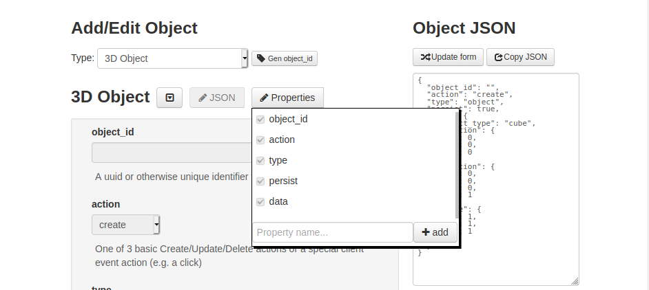

# ARENA Build Page



The [build page](https://arena.andrew.cmu.edu/build) in the ARENA allows you to see the current scenes and their contents, as well as adding and editing the objects inside.

[add basic build stuff here]

## Add a Basic 3D Object

## Removing Objects

## Adding a 3D Model Using the Scene Editor

To add a 3D model to a scene, make sure that it is stored on the [file store](https://arena.andrew.cmu.edu/storemng/) first. Under Add/Edit object, make sure that Type: "3D Object" is selected. Under the 3D Object header, enter a name for the object (typically a human-readable name, however you could also generate a UUID if desired). Make sure that "create" is selected under the action. Set persist to either true or false, depending on your preferences. Next to the 3d Object Data header, click on "properties" and make sure that "URL" is checked. This will ensure that you can add a URL attribute to the object, which is necessary for loading a model. The object type for a 3D model is gltf-model. You can alter the position, rotation, and scale in these attributes.

[add URL info]

## Adding and Running a Program using the Scene Editor

[Python App Upload Walkthrough](../arts/python)

## Adding Scene Options

- [JSON Scene Options Definition](../messaging/definitions.html#env-presets-object)

